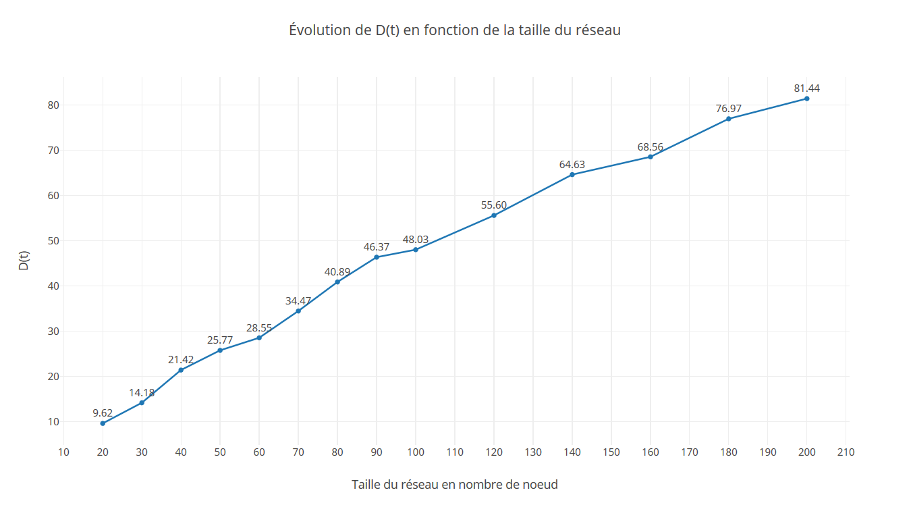
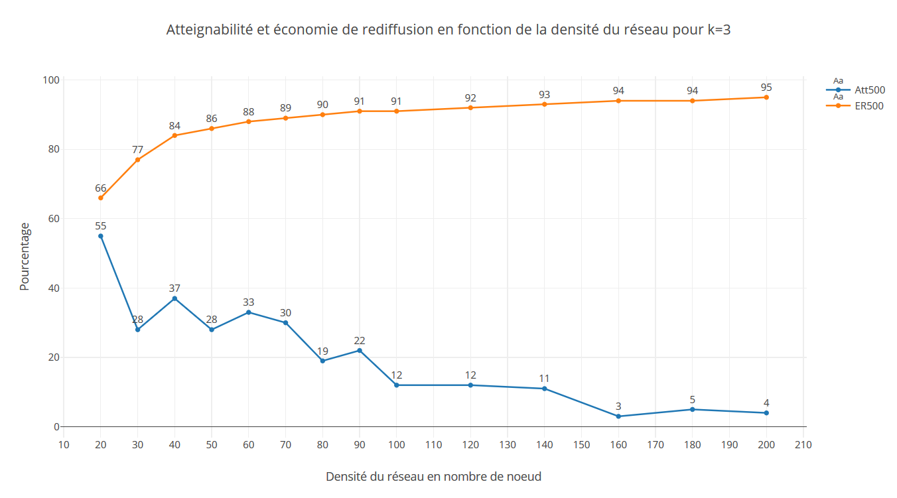

# Projet ARA: Simulation de MANET avec PeerSim


Étudiants:
- Nicolas Guittonneau (3604340)
- Yoann Ghigoff (3506454)


Les figures sont situées en fin de document.

### Exercice 1

#### Question 1

Donnez l'algorithme général de déplacement d'un noeud:
```
Initialement le noeud n'est pas en mouvement.

move:
Si le noeud n'est pas en mouvement:
  - calcul aléatoire de la vitesse du noeud
  - calcul de sa prochaine destination en se basant sur la stratégie de 
  destination

Calcul de la distance courante restante à parcourir
Calcul de la distance totale à parcourir par le noeud jusqu'à sa prochaine 
destination.

Si le noeud est arrivé à destination:
	il s'arrête et s'envoit un Event de type pause qui va relancer l'algorithme
	move après que le temps 'pause' soit écoulé.
Sinon:
	Le noeud se déplace vers sa destination et s'envoit un Event pour déclencher 
	son prochain déplacement.
```

#### Question 2
Contenu du fichier de configuration Peersim pour cette question:
```
random.seed 6
network.size 42
simulation.endtime 200000

protocol.positionprotocolimpl PositionProtocolImpl
protocol.positionprotocolimpl.maxspeed 100
protocol.positionprotocolimpl.minspeed 10
protocol.positionprotocolimpl.width 1000
protocol.positionprotocolimpl.height 1000
protocol.positionprotocolimpl.pause 3000

initial_position_strategy Strategy1InitNext
initial_position_strategy.positionprotocol positionprotocolimpl
next_destination_strategy Strategy1InitNext
next_destination_strategy.positionprotocol positionprotocolimpl

control.graphicalmonitor GraphicalMonitor
control.graphicalmonitor.positionprotocol positionprotocolimpl
control.graphicalmonitor.time_slow 0.0002
control.graphicalmonitor.step 1

init.init_module Initialisation
```

#### Question 3

- SD: Stratégie déplacement
- SPI: Stratégie Position Initiale

Pour la stratégie 1:

La SD définit une position pseudo aléatoire comprise entre les paramètres width et height définis dans le fichier de config.
La SPI de la Stratégie 1 appelle simplement le SD avec une vitesse de zéro.


#### Question 4

La SD de la stratégie 2 retourne la position actuelle du noeud. Les noeuds sont donc statiques.

#### Question 8

- Stratégie 3

  Cette SD repose sur le paramètre scope, définissant une zone de deplacements carré centrée sur le milieu de la fenêtre.
  La taille de la zone est définie par la formule: (scope-20)x2 	
  Si scope < 20, la zone est de taille 0, tous les noeuds sont donc statiques au milieux de la fenêtre.
  Dans le pire des cas, les noeuds peuvent être de part et d'autre de la diagonale du carré, soit à une distance de n*Sqrt(2), 
  avec n etant la taille d'un coté de la zone.
  Ce qui revient à résoudre l'inégalité suivante:
  ((scope-20)*2)xSqrt(2) < scope
  
  Après simplification:
  scope < ~30.93
  
  Le graphe est donc connexe pour un scope de 0 à 30.

- Stratégie 4

  Si le graphe est connexe à l'initialisation, deplace les noeuds dans la zone tout en conservant la propriété connexe du graphe.

- Stratégie 5

  Cette SPI garantie que la distance maximum entre deux noeuds est bornée par le mimimum entre le scope et le parametre distance_init_max. 
  La SPI génère donc un graphe connexe.

- Stratégie 6

  Cette SPI forme une topologie en "étoile" autour du centre de la fenêtre. L'angle de chaque noeud est calculé en fonction de son ID, et la distance depuis le centre est calculé en fonction du scope et de la taille du réseau, garantissant de générer un graphe connexe.

#### Question 10

Évolution de la densité en fonction de la portée et de la stratégie utilisée.


| portée | SPI | SD | D(t) | E(t) / D(T) | ED(t) / D(T) |
|--------|-----|----|------|-------------------|--------------------|
|     125|    1|   1|  1,00|               1,35|                0,18|
|     250|    1|   1|  3,87|               1,11|                0,12|
|     375|    1|   1|  8,01|               1,05|                0,09|
|     500|    1|   1| 12,99|               1,03|                0,10|
|     625|    1|   1| 19,09|               1,03|                0,09|
|     750|    1|   1| 24,84|               1,02|                0,08|
|     875|    1|   1| 30,12|               1,01|                0,07|
|    1000|    1|   1| 35,71|               0,99|                0,06|
|        |     |    |      |                   |                    |
|     125|    3|   3| 30,19|               1,01|                0,08|
|     250|    3|   3| 27,21|               1,01|                0,08|
|     375|    3|   3| 26,06|               1,01|                0,10|
|     500|    3|   3| 25,70|               1,01|                0,09|
|     625|    3|   3| 25,06|               1,02|                0,08|
|     750|    3|   3| 25,36|               1,02|                0,07|
|     875|    3|   3| 25,46|               1,02|                0,07|
|    1000|    3|   3| 25,19|               1,02|                0,08|

#### Question 11

- Stratégie 1:
  La taille de la zone étant fixe, l'augmentation de la portée est donc directement proportionnelle avec celle de la densité.
- Stratégie 3:
  La taille de la zone de déplacement augmente proportionnellement avec le scope, la densité reste donc constante avec l'augmentation de la portée.
  
  
### Exercice 2

#### Question 1

Évolution de la densité en fonction de la taille du réseau.


| Taille du réseau | D(t)  | ED(t) / D(T) |
|------------------|-------|-------------------|
|                20|  9,62 |               0,24|
|                30|  14,18|               0,21|
|                40|  21,42|               0,10|
|                50|  25,77|               0,06|
|                60|  28,55|               0,09|
|                70|  34,47|               0,06|
|                80|  40,89|               0,05|
|                90|  46,37|               0,04|
|               100|  48,03|               0,04|
|               120|  55,20|               0,03|
|               140|  64,63|               0,02|
|               160|  68,56|               0,04|
|               180|  76,97|               0,02|
|               200|  81,44|               0,02|


_Courbes: Voir figures 1 et 2_

Sans surprise avec une taille du terrain constante, la densité du réseau augmente avec le nombre de noeud. De même, la variation de la densité diminue avec l'augmentation de la taille du réseau.
On peut conclure qu'à partir d'un réseau de taille 50, la variation du nombre de voisins reste à peu près constante durant toute la simulation.

#### Question 2

Pour détecter la terminaison d'un gossip, il suffit de maintenir deux variables représentant le nombre de messages reçus et le nombre de messages envoyés. Lorsque ces deux variables sont identiques, c'est que tous les messages envoyés ont été reçus, et qu'il n'y a donc plus de messages en cours de transmission. La diffusion est donc terminée, on peut alors lancer la suivante.

#### Question 4

_Courbes: Voir figures 3 et 4_

L'atteignabilité est de 100% quelque soit la taille du réseau, ce résultat est logique puisque que l'algorithme de flooding retransmet les messages dans tous les cas et le réseau est connexe durant toute la simulation (garantie par SPI_5 et SD_4).

#### Question 5

_Courbe: Voir figure 5_

Pour chaque test, l'économie de rediffusion correspond à la valeur de probabilité donnée en entrée.
Pour les valeurs de p supérieures à 0.5, la taille du réseau ne semble pas avoir d'impact sur les résultats, en revanche, pour un une probabilité p inférieure, on note une nette amélioration de l'atteignabilité lorsque le réseau dépasse 50 noeuds, taille a partir de laquelle le nombre de voisins est constant, comme démontré à la question 1.

#### Question 6

_Courbes: Voir figures 6 à 10_

Afin de maximiser à la fois Att et Er, il semble logique que la probabilité doit être inversement proportionelle à la taille du voisinage, en effet, si la densité est importante, la probabilité qu'un voisin ai reçu le message en même temps que moi même est plus élevée. On remarque sur les graphiques que les meilleurs résultats sont dans la fourchette d'une taille de réseau de 40-70 noeuds. Pour des réseaux plus petits, l'atteignabilité est trop faible, dû au fait qu'il n'y ai pas assez de voisins, et pour les réseaux plus grand la rediffusion est trop élévée, dû à la densité trop élévée.

#### Question 7

_Courbe: Voir figure 11_

Comparé aux algorithmes précedents, c'est pour le moment la solution qui semble la plus optimale et qui offre la meilleure maximisation à la fois de l'atteignabilité et de l'économie de rediffusion, et ce quelque soit la taille du réseau. Avec une atteignabilité moyenne proche de 100% pour toute taille de réseau, et une économie de rediffusion aux alentours de 17%.

Évolution de l'atteignabilité et de l'économie de rediffusion en fonction de la densité du réseau 
et en utilisant un algorithme probabiliste basé sur la distance émetteur-récepteur.

| Taille du réseau | Att500 Moyen (%) | ER500 Moyen (%) | Ecart-type Att | Ecart-type ER |
|------------------|------------------|-----------------|----------------|---------------|
|                20|                98|               19|           11,76|           9,58|
|                30|               100|               23|            0,00|          10,30|
|                40|                96|               23|           17,62|           9,74|
|                50|               100|               21|            0,00|           8,54|
|                60|               100|               19|            0,00|           7,59|
|                70|               100|               20|            0,00|           7,69|
|                80|               100|               18|            0,00|           7,91|
|                90|               100|               19|            0,00|           7,66|
|               100|               100|               18|            0,00|           7,27|
|               120|               100|               17|            0,00|           7,87|
|               140|               100|               17|            0,00|           6,83|
|               160|               100|               15|            0,00|           6,68|
|               180|               100|               15|            0,00|           6,60|
|               200|               100|               15|            0,00|           6,64|


#### Question 8

##### Algorithme 3 avec mécanisme de rediffusion

Évolution de l'atteignabilité et de l'économie de rediffusion en fonction de la densité du réseau
et en utilisant un algorithme basé sur la densité locale avec mécanisme de rediffusion.

| Taille du réseau |  k  | Att500 Moyen (%) | ER500 Moyen (%) |
|------------------|-----|------------------|-----------------|
|                20|   1 |                40|               73|
|                30|   1 |                34|               76|
|                40|   1 |                42|               80|
|                50|   1 |                40|               81|
|                60|   1 |                38|               83|
|                70|   1 |                41|               83|
|                80|   1 |                33|               83|
|                90|   1 |                32|               83|
|               100|   1 |                26|               83|
|               120|   1 |                30|               84|
|               140|   1 |                27|               84|
|               160|   1 |                23|               84|
|               180|   1 |                22|               84|
|               200|   1 |                21|               84|
|                20|   2 |                53|               70|
|                30|   2 |                43|               74|
|                40|   2 |                51|               79|
|                50|   2 |                45|               81|
|                60|   2 |                45|               82|
|                70|   2 |                48|               83|
|                80|   2 |                40|               83|
|                90|   2 |                39|               83|
|               100|   2 |                34|               84|
|               120|   2 |                35|               85|
|               140|   2 |                37|               85|
|               160|   2 |                31|               85|
|               180|   2 |                31|               85|
|               200|   2 |                31|               86|
|                20|   3 |                68|               62|
|                30|   3 |                44|               71|
|                40|   3 |                57|               78|
|                50|   3 |                56|               80|
|                60|   3 |                56|               81|
|                70|   3 |                59|               82|
|                80|   3 |                48|               83|
|                90|   3 |                51|               84|
|               100|   3 |                44|               84|
|               120|   3 |                43|               85|
|               140|   3 |                48|               86|
|               160|   3 |                36|               85|
|               180|   3 |                39|               86|
|               200|   3 |                36|               86|
|                20|   4 |                71|               51|
|                30|   4 |                53|               66|
|                40|   4 |                69|               76|
|                50|   4 |                63|               78|
|                60|   4 |                65|               80|
|                70|   4 |                64|               81|
|                80|   4 |                55|               82|
|                90|   4 |                58|               83|
|               100|   4 |                49|               83|
|               120|   4 |                53|               85|
|               140|   4 |                52|               86|
|               160|   4 |                50|               86|
|               180|   4 |                48|               87|
|               200|   4 |                49|               87|
|                20|   5 |                85|               45|
|                30|   5 |                64|               62|
|                40|   5 |                77|               73|
|                50|   5 |                71|               75|
|                60|   5 |                76|               78|
|                70|   5 |                75|               79|
|                80|   5 |                63|               81|
|                90|   5 |                70|               82|
|               100|   5 |                60|               82|
|               120|   5 |                64|               84|
|               140|   5 |                64|               86|
|               160|   5 |                58|               86|
|               180|   5 |                53|               86|
|               200|   5 |                54|               87|

_Courbes: Voir figures 12 à 16_


##### Algorithme 4 avec mécanisme de rediffusion

Évolution de l'atteignabilité et de l'économie de rediffusion en fonction de la densité du réseau 
et en utilisant un algorithme basé sur la distance émetteur-récepteur avec mécanisme de rediffusion.

| Taille du réseau | Att500 Moyen (%) | ER500 Moyen (%) | Ecart-type Att | Ecart-type ER |
|------------------|------------------|-----------------|----------------|---------------|
|                20|               100|               32|            0,00|          10,45|
|                30|                98|               33|           14,00|           8,63|
|                40|               100|               34|            0,00|           8,27|
|                50|               100|               34|            0,00|           7,68|
|                60|               100|               33|            0,00|           6,67|
|                70|               100|               32|            0,00|           6,11|
|                80|               100|               33|            0,00|           6,46|
|                90|               100|               31|            0,00|           6,03|
|               100|               100|               32|            0,00|           5,66|
|               120|               100|               31|            0,00|           5,33|
|               140|               100|               31|            0,00|           4,79|
|               160|               100|               30|            0,00|           5,02|
|               180|               100|               29|            0,00|           4,91|
|               200|               100|               29|            0,00|           4,46|

_Courbe: Voir figure 17_

Pour les deux algorithmes, l'economie de rediffusion à fortement augmenté sans avoir de conséquences négatives sur l'atteignabilité, en effet un gain d'environs respectivement 25% et 15% sur les algorithmes 3 et 4 est visible sur les graphiques. 

#### Question 9

Si l'atteignabilité est la priorité, quelquesoit la taille du réseaux, c'est l'algorithme 4 avec l'approche non probabiliste qu'il faut choisir.
Si en revanche vous souhaitez maximiser les deux, pour un réseaux supérieur à 80 noeuds, il faut choisir 3 de densité locale, sinon encore une fois, l'algorithme 4 qui retransmet suivant la distance des voisins est le meilleur. 

### Figures







